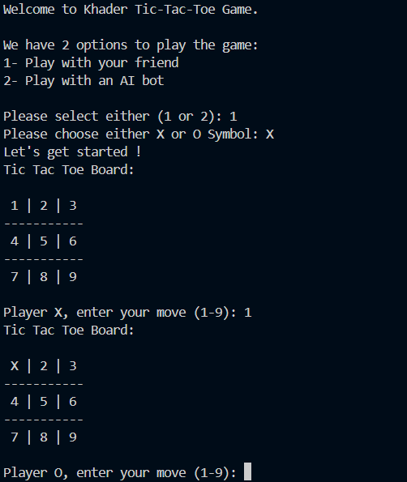

# Tic-Tac-Toe

## Description
A simple Tic Tac Toe game developed using dart programming language.

## Prerequisites
Dart installed

## How to run it
Run the below commands
```cmd
git clone https://github.com/KhaderBallout/tic-tac-toe.git
cd tic-tac-toe
dart main.dart
```
## Sample Output

